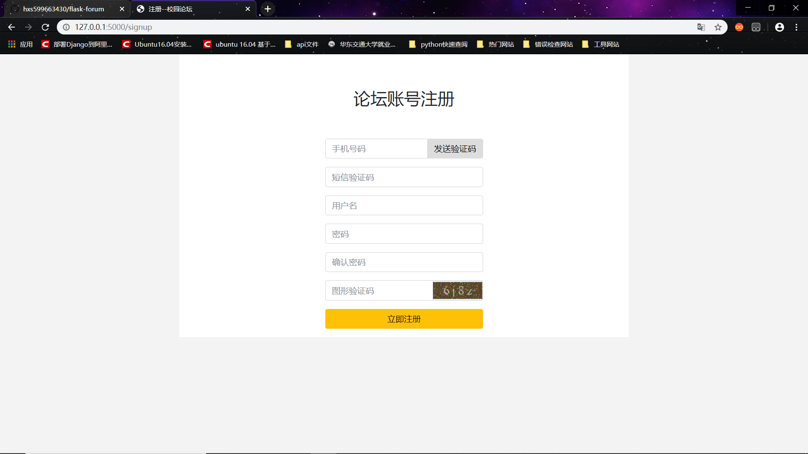
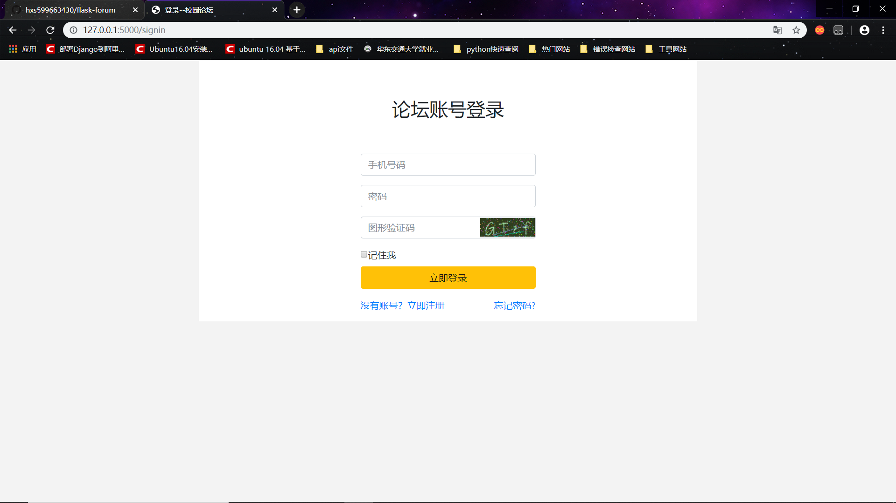
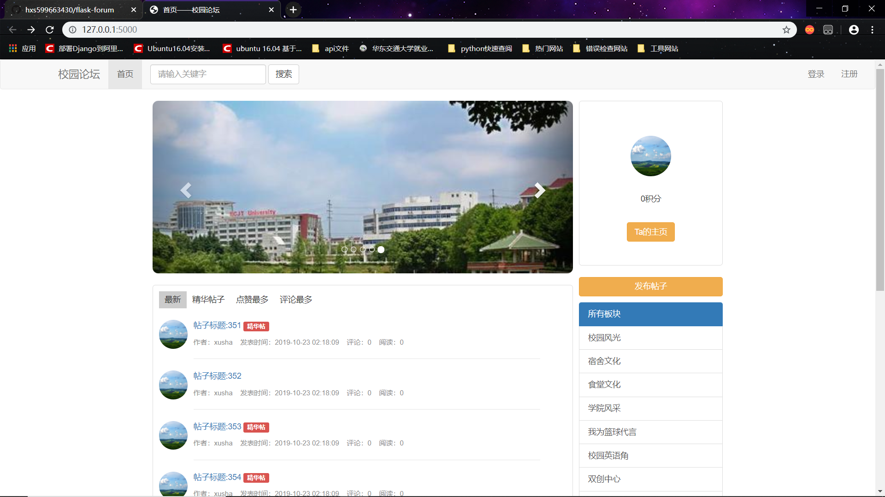
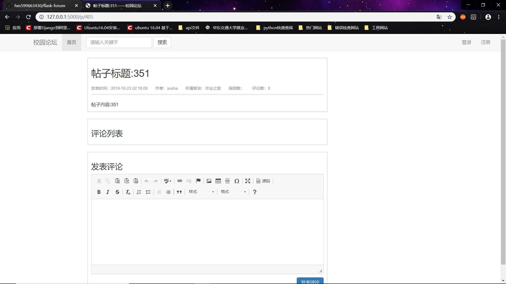
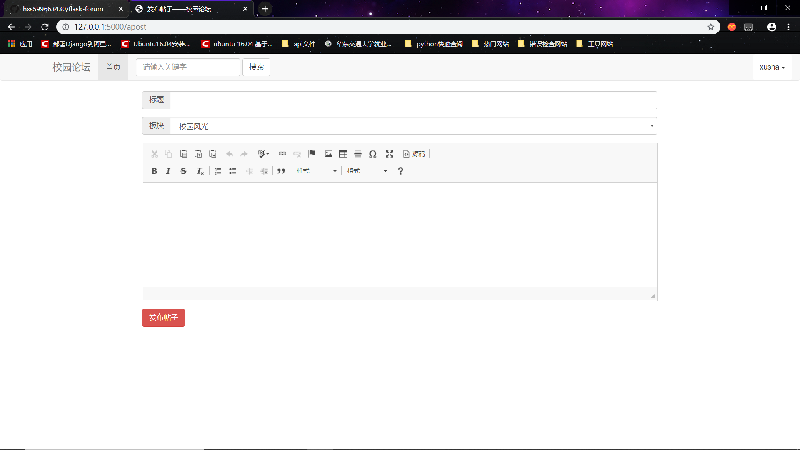
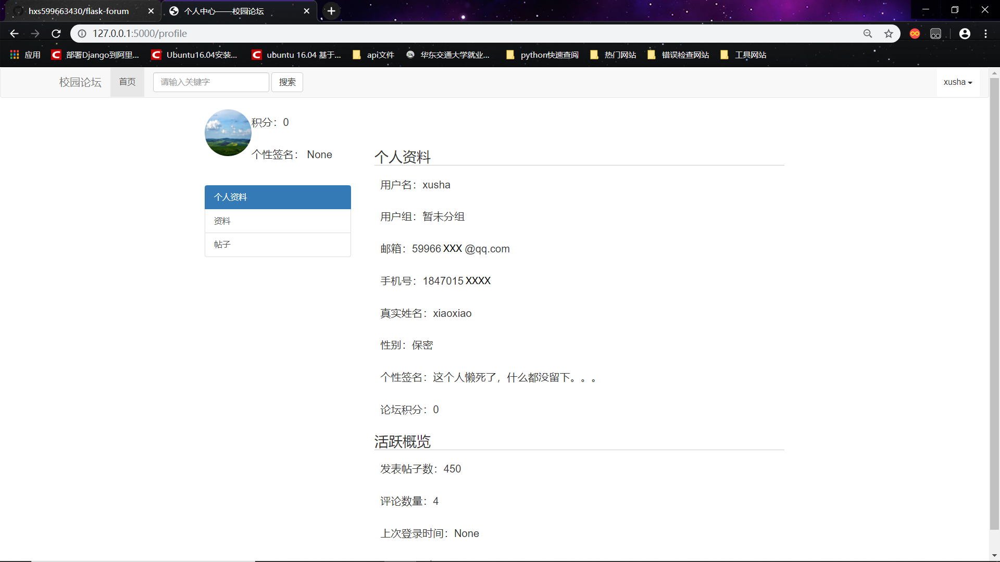
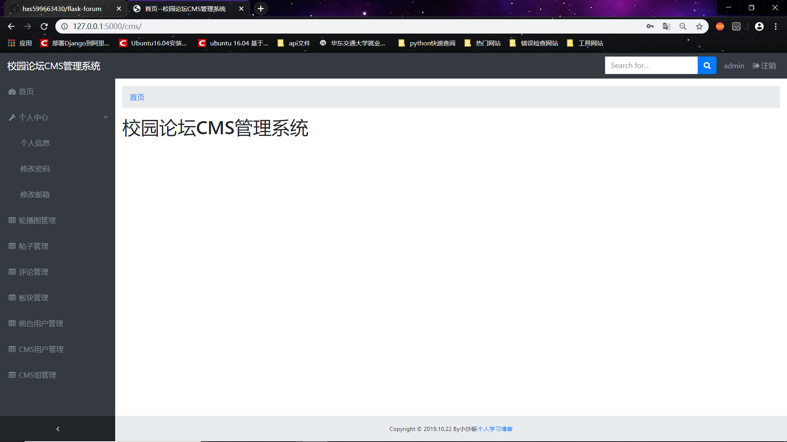
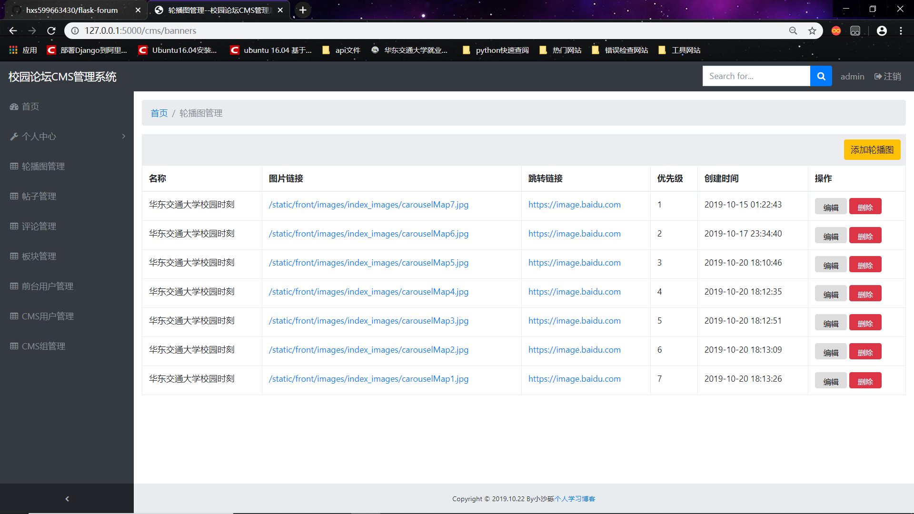
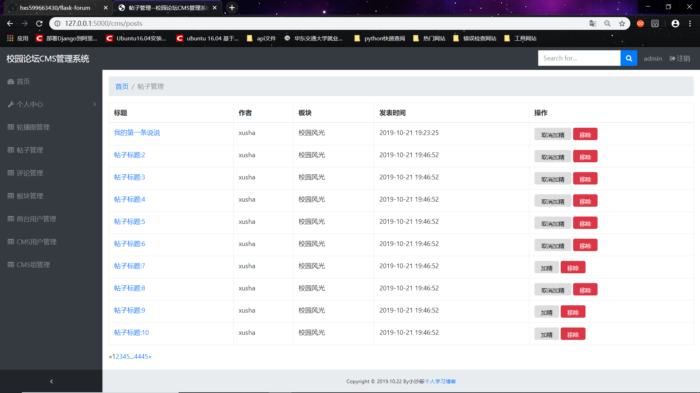

# 基于python web 框架Django开发的校园论坛

项目背景：基于每个学校都有表白墙的思路开发的校园论坛项目

技术使用：python、flask框架、MySQL、Redis、HTML5、CSS3、JavaScript、jQuery、sweetalert

项目介绍：前台主要分为首页、帖子发表、帖子评论、个人中心、注册和登录。后台主要分为首页、个人信息、轮播图管理、帖子管理、评论管理、板块管理等

​	1、前台首页主要负责帖子显示、帖子板块、轮播图展示等

​	2、帖子发表主要使用flask框架的扩展CKEditor编辑器来发表帖子

​	3、帖子评论使用flask框架的扩展CKEditor编辑器来对当前帖子增加评论

​	4、个人中心主要展示当前用户的信息（管理暂未添加）

​	5、注册采用手机号码及手机号验证码、图形验证码等形式注册

​	6、登录采用图形验证码登录

​	7、后台首页主要展示当前后台登录用的欢迎

​	8、轮播图、板块管理主要负责增加、删除、修改、显示

#### 项目展示

前台注册界面：

前台登录界面：

校园论坛首页：

帖子详情页面：

帖子发表界面：

个人中心页面：

后台首页界面：

轮播图管理界面：

帖子管理界面：

